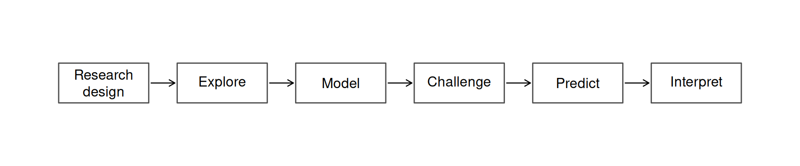

# Quantitative Ecology: From Research Design to Predictive Modelling

**A one-week intensive course for postgraduate students and researchers**

Ecological research increasingly involves complex data and increasingly sophisticated analytical tools. The challenge is not simply knowing how to use those tools, but understanding which questions they can answer, what assumptions they make, and what their results mean biologically.

**Quantitative Ecology: From Research Design to Predictive Modelling** approaches quantitative analysis as part of the scientific process. Starting with ecological questions and research design, the course follows an investigation through data exploration, statistical modelling and interpretation, before making the transition from explaining observed patterns to predicting new observations.

R is used throughout as the working language, but **this is not primarily an R course**. The emphasis is on developing a way of thinking about ecological data:

## Course philosophy

The course is organised around **investigations rather than techniques**.

Statistical methods are introduced because an ecological question requires them. Rather than learning a sequence of disconnected methods and datasets, participants repeatedly revisit ecological problems as their understanding develops and new questions emerge.

A simple model may reveal an important ecological relationship, but it may also expose structure that it cannot represent. That leads naturally to the next question and, where necessary, to a more appropriate model.

The aim is therefore not to ask:

> _Which model should I use?_

but instead:

> _What am I trying to understand, and what must a model represent to answer that question?_

This approach also provides the basis for understanding the relationship between classical statistical modelling and modern predictive approaches. Explanation and prediction are related, but they are not the same scientific objective.

## Core course: five days

| Day                                           | Question                                        | Quantitative ideas                                                                                   |
| --------------------------------------------- | ----------------------------------------------- | ---------------------------------------------------------------------------------------------------- |
| **1. Understanding the evidence**            | What do we actually have?                       | Research design, sampling, exploratory analysis, distributions, missing data and uncertainty         |
| **2. Explaining variation**                  | Can we explain the patterns we observe?         | Generalised linear models, response distributions, link functions and biological interpretation      |
| **3. Representing ecological relationships** | What if relationships are not linear?           | Generalised additive models, smooth relationships and ecological interpretation                      |
| **4. Recognising structure**                 | What if observations are not independent?       | Hierarchical data, mixed models, random effects and sources of variation                             |
| **5. Prediction**                            | Can our understanding predict new observations? | Prediction, validation, cross-validation, generalisation and an introduction to predictive modelling |

The progression is cumulative. Participants work with a small number of ecological datasets throughout the course rather than encountering a new demonstration dataset for every statistical method. Each stage builds on what has already been learned about the ecological system.

## Extending the core

The five-day course provides the foundation for further quantitative ecological modelling. A second five-day module extends the same reasoning into space and time, asking what changes when ecological observations span locations, years and environmental conditions.

Rather than introducing spatial and temporal analysis as separate collections of techniques, the extension begins with the models developed in the core course and progressively expands the domain in which they are expected to operate:

**Space → Time → Integration → Prediction → Forecasting**

The emphasis shifts from understanding and predicting observations within a relatively bounded ecological dataset to asking where, when and under what conditions that understanding can be expected to generalise.

For the developing five-day extension, see [**Ecological Models in Space and Time**](space-time-outline.md).

## From explanation to prediction

Much of ecological statistics asks whether observed variation can be explained:

> _What relationships exist in these data?_

Predictive modelling introduces a subtly different question:

> _Does what we have learned generalise to observations the model has never seen?_

This change in question motivates ideas such as training and test data, cross-validation, regularisation and model comparison. These are introduced as extensions of the scientific reasoning developed earlier in the course rather than as a separate machine-learning toolbox.

The emphasis remains on the ecological problem: prediction is useful only when we understand what is being predicted, from what information, and under what conditions we expect that prediction to work.

## Working with R

R provides the common analytical environment for the course. Code is kept deliberately transparent so that participants can see the progression from data to model to interpretation.

The course primarily uses established tools including:

* base R

* `ggplot2`

* `mgcv`

* `lme4` / `glmmTMB`

* `MASS`

The objective is not to learn a large collection of packages. Readable code and understandable intermediate steps are preferred to highly abstracted analytical workflows.

Course materials are developed using **Quarto**, combining explanation, executable R code, figures and model output in reproducible documents.

## Who is the course for?

The course is intended primarily for postgraduate students and researchers working with ecological or environmental data.

Some previous exposure to R is useful, but advanced programming experience is not required. The emphasis is on quantitative reasoning rather than programming expertise.

Participants should leave the course better able to:

* translate ecological questions into quantitative analyses;

* recognise how research design affects subsequent inference;

* explore data before deciding how to model them;

* understand the assumptions and biological meaning of statistical models;

* recognise when additional model complexity is justified;

* distinguish explanation from prediction; and

* evaluate how well ecological models generalise beyond the observations used to build them.

## Example investigation

A short example investigation is included in this repository to demonstrate the question-driven approach used throughout the course.

Rather than presenting a statistical technique and then demonstrating its use, the example begins with an ecological pattern, asks what might explain it, and considers whether a simple model adequately represents the observed biology.

[**Explore the example investigation**](example/ecological-investigation.md)

The example uses a small synthetic reef-fish transect dataset included in this repository, and is illustrative rather than a complete course exercise. Full practical sessions develop these ideas through extended ecological investigations, discussion and interpretation.

## Course materials

This repository provides an overview of the course, setup information and selected example material.

The complete teaching materials, practical exercises and worked investigations are used during course delivery and are not reproduced here.

For software requirements and installation guidance, see [**Setup**](setup.md).

For the five-day core course, see [**Course outline**](course-outline.md).

For the developing extension, see [**Ecological Models in Space and Time**](space-time-outline.md).

***

_Quantitative Ecology: From Research Design to Predictive Modelling_ is developed and taught by Craig Syms through Ecological Analytics.
