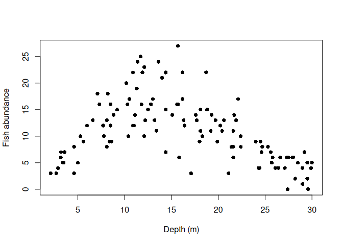
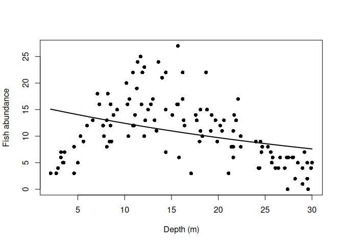

# A Small Ecological Investigation


## The ecological setting

A reef fish survey was conducted across eight sites spanning a depth
gradient. At each site, fish abundance was recorded on 15 standardised
transects, together with water depth and a simple measure of habitat
complexity.

Our first question is deliberately straightforward:

> **How does fish abundance vary with depth?**

Before choosing a statistical model, we should look at the observations.

``` r
fish <- read.csv("data/reef_fish_transects.csv")

head(fish)
```

      transect site depth_m complexity abundance
    1        1   S1    29.5        2.2         5
    2        2   S1    17.6        1.0        14
    3        3   S1    16.4        2.7        12
    4        4   S1    11.0        2.2        12
    5        5   S1    29.9        2.3         4
    6        6   S1     7.8        2.8        10

## Start with the ecology

``` r
plot(
  abundance ~ depth_m,
  data = fish,
  pch = 16,
  xlab = "Depth (m)",
  ylab = "Fish abundance"
)
```



Before doing anything else, consider the pattern.

- Is abundance constant across the sampled depth range?
- Where are the highest abundances observed?
- Does the relationship appear approximately linear?
- What ecological processes might produce the pattern?

There is already quite a lot of ecological information in this figure.

The next question is whether a simple statistical model represents it
adequately.

## A first model

Fish abundance is a count, so we will begin with a Poisson generalised
linear model.

For the moment, we will make the deliberately simple assumption that
expected abundance changes continuously with depth.

``` r
m1 <- glm(
  abundance ~ depth_m,
  family = poisson,
  data = fish
)

summary(m1)
```


    Call:
    glm(formula = abundance ~ depth_m, family = poisson, data = fish)

    Coefficients:
                 Estimate Std. Error z value Pr(>|z|)    
    (Intercept)  2.765900   0.058786  47.050  < 2e-16 ***
    depth_m     -0.024560   0.003497  -7.023 2.17e-12 ***
    ---
    Signif. codes:  0 '***' 0.001 '**' 0.01 '*' 0.05 '.' 0.1 ' ' 1

    (Dispersion parameter for poisson family taken to be 1)

        Null deviance: 417.07  on 119  degrees of freedom
    Residual deviance: 367.01  on 118  degrees of freedom
    AIC: 853.92

    Number of Fisher Scoring iterations: 4

The estimated coefficient for depth is strongly different from zero.

Taken by itself, that result might encourage us to conclude that we have
found an important relationship between depth and fish abundance.

But statistical evidence for a relationship is not the same thing as an
adequate ecological description of that relationship.

## Look again

We can add the fitted relationship to the original observations.

``` r
newdat <- data.frame(
  depth_m = seq(
    min(fish$depth_m),
    max(fish$depth_m),
    length.out = 200
  )
)

newdat$predicted <- predict(
  m1,
  newdata = newdat,
  type = "response"
)

plot(
  abundance ~ depth_m,
  data = fish,
  pch = 16,
  xlab = "Depth (m)",
  ylab = "Fish abundance"
)

lines(
  newdat$depth_m,
  newdat$predicted,
  lwd = 2
)
```



Now compare the fitted model with the pattern in the observations.

The model has detected a relationship with depth.

But has it represented the relationship we actually saw?

In particular:

- What happens in shallow water?
- What happens at intermediate depths?
- What happens in deeper water?
- Which features of the observed pattern can the fitted model never
  reproduce?

## The next question

The important conclusion is not that the model is simply “wrong”.

The model answered the question we asked of it: whether expected
abundance changes in a consistent direction with depth.

The ecological pattern suggests that this question may be too simple.

So rather than immediately asking:

> **Which statistical technique should we use instead?**

a more useful question is:

> **What structure in the ecology must our model be able to represent?**

That question provides the starting point for the next stage of the
investigation.

------------------------------------------------------------------------

*This short investigation illustrates the question-driven approach used
throughout* **Quantitative Ecology: From Research Design to Predictive
Modelling**. *Statistical methods are introduced as ecological questions
require them, rather than as a sequence of independent techniques.*
